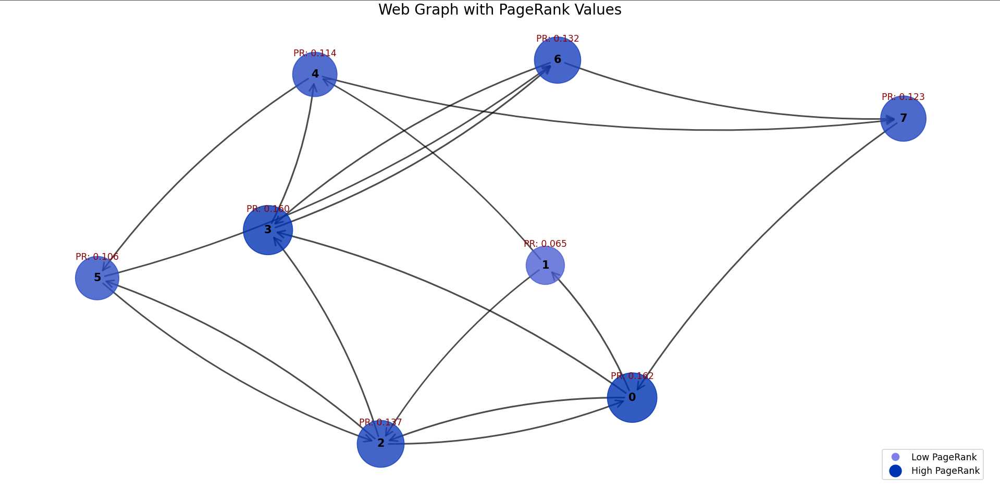

# **PageRank Algorithm**

## **Overview**

PageRank is a link analysis algorithm developed by **Larry Page and Sergey Brin**, the founders of Google.  
It evaluates the **importance of web pages** based on the **number and quality of links** pointing to them.

The core idea is:

- A page is **more important** if many **important pages** link to it.

---

## **How PageRank Works**

PageRank assigns a **numerical weight** to each webpage. The higher the value, the more important the page is considered.

### **Key Principles:**

- A page’s **importance is determined** by the importance of pages **linking to it**.
- The **rank is distributed** among outgoing links.
- A **damping factor** (typically **0.85**) accounts for **random jumps** to any webpage.

PageRank can be computed using two main approaches:

1. **Iterative/Numerical Method** (Basic Definition)
2. **Matrix Multiplication (Power Iteration Method)**

---

## **1. Iterative/Numerical Method**

### **Formula:**

\[
PR_{t+1}(i) = sum_{j in B_i} (PR_t(j) / C(j))
\]

Where:

- **PR_t+1(i)** → PageRank of page **i** at iteration **t+1**.
- **B_i** → Set of pages linking to page **i**.
- **C(j)** → Number of outgoing links from page **j**.

### **Steps:**

1. Start with an **equal** initial PageRank for all pages.
2. Update each page’s rank using the **formula**.
3. **Repeat** until convergence (**when changes are minimal**).

---

## **2. Matrix Multiplication (Power Iteration Method)**

### **Transition Matrix:**

A **directed web graph** can be represented as a **stochastic transition matrix** **M**, where:

- Each entry **M[i, j]** represents the **probability** of moving from page **j** to page **i**.
- **Columns sum to 1**, ensuring a probability distribution.

### **Power Iteration Method:**

The PageRank **vector** **PR** is computed using **repeated matrix multiplications**:

1. Construct the **transition matrix** **M**.
2. Initialize **PageRank vector** with equal values.
3. Multiply **iteratively** until values **stabilize**.

---

## **3. Damping Factor & Final Formula**

To **prevent dead ends** (pages with no outgoing links) and **spider traps** (loops), a **damping factor (d)** (**typically 0.85**) is introduced.

### **Final PageRank Formula:**

\[
PageRank = d * M' * PageRank + (1 - d) * v
\]

Where:

- **d** → Damping factor.
- **M'** → Modified transition matrix with teleportation.
- **v** → Teleportation vector (typically **uniform**).

---

## **Visualization**



---

## **Usage**

To run the Python implementation:

```bash
python pagerank.py
```

---

## **Dependencies**

To run the code, ensure you have the following Python libraries installed:
- `numpy`
- `networkx`
- `matplotlib`

You can install them using:
```bash
pip install numpy networkx matplotlib
```

---

## **Conclusion**

PageRank remains one of the most influential algorithms in search ranking.
Understanding both its numerical and matrix-based formulations provides insights into its efficiency and real-world applications.
